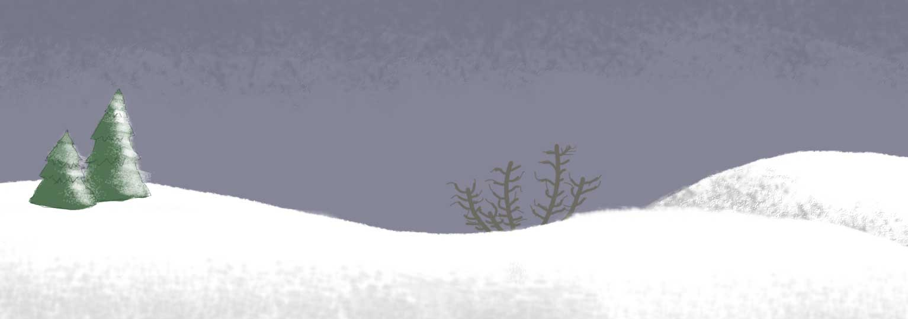

# Interactive Wolf Animation - JavaScript Pet Control Game

A browser-based interactive animation where users control a wolf character through various commands and movements. Built with vanilla JavaScript, HTML5, and CSS3.



## Features

- **Multiple Wolf Animations**: Control the wolf with various commands
  - Howl
  - Lie down
  - Point
  - Play dead
  - Sit
- **Smooth Movement**: Left/right movement with automatic boundary detection
- **Responsive Controls**: Visual feedback with custom-styled buttons
- **Scene-Based System**: Wolf stays within container boundaries
- **Animated Sprites**: Dynamic wolf sprites that respond to user input

## Technologies

- Pure JavaScript (no frameworks)
- CSS3 animations and gradients
- HTML5 structure
- Event-driven programming

## How to Run

1. Clone this repository:
   ```bash
   git clone https://github.com/epdsn/Wolf-Animation.git
   ```

2. Open `A4_Perez.html` in your web browser

3. Use the control buttons to interact with the wolf!

## Controls

- **Action Buttons**: Howl, Lie Down, Point, Play Dead, Sit
- **Movement Controls**: 
  - Left arrow button - Move wolf left
  - Stop button - Stop the wolf
  - Right arrow button - Move wolf right

## Credits

Wolf sprites by: [KitsuneRedWolf on DeviantArt](http://kitsuneredwolf.deviantart.com/art/Wolf-Sprites-Emotions-245567612)

## Author

Eric Perez

## License

This project is open source and available for educational purposes.
